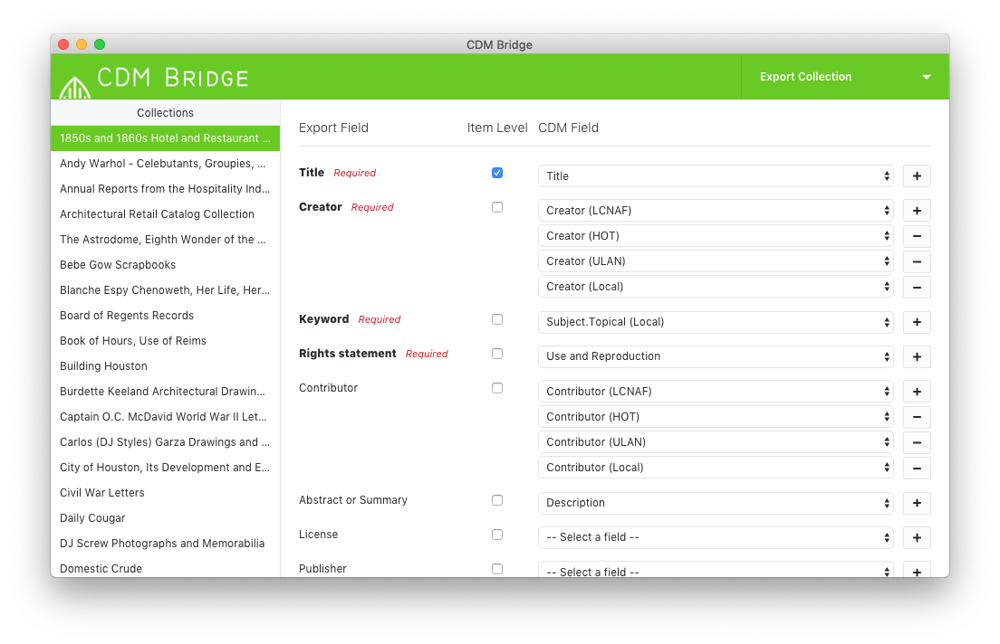

# CDM Bridge

[](https://travis-ci.org/Bridge2Hyku/cdm-bridge)
[](https://raw.githubusercontent.com/Bridge2Hyku/cdm-bridge/master/LICENSE)


CDM Bridge is an open source [Electron](https://electronjs.org/)-based [CONTENTdm](https://www.oclc.org/en/contentdm.html) migration tool. It is written in [TypeScript](https://www.typescriptlang.org/) and uses [React](https://reactjs.org/).

Part of the [Bridge2Hyku](https://bridge2hyku.github.io/) project.



## Develpment

The use of the [yarn](https://yarnpkg.com/) package manager is strongly recommended, as opposed to using `npm`.

```
# install dependencies
yarn

# run application in development mode
yarn dev

# compile source code and create webpack output
yarn compile

# create distribution package, `yarn compile` & create build with electron-builder
yarn dist

# `yarn compile` & create unpacked build with electron-builder
yarn dist:dir
```

The main process is at `src/main/index.ts` and the renderer process is at `src/ui/index.tsx`

All compiled distributions are created in `release/`

## License

**[Apache-2.0](LICENSE)**

CONTENTdm is a registered trademark of OCLC, inc.